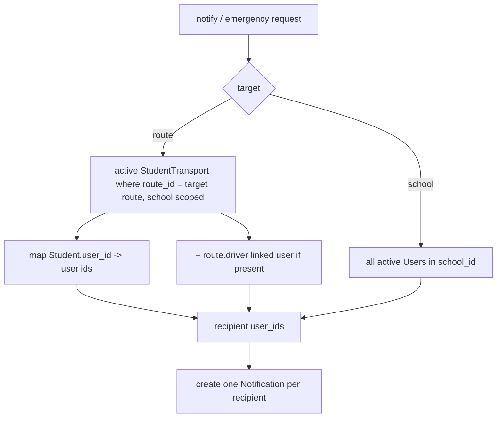
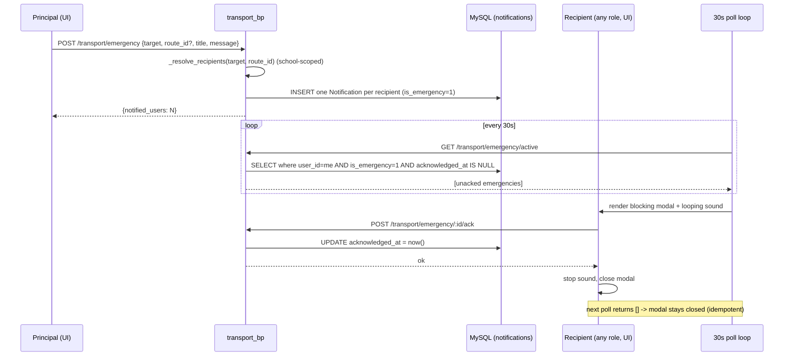

# Design Document: Principal Transport Management

## Overview

Principal Transport Management is an additive extension of the existing transport module (`backend/app/routes/transport.py`, `backend/app/models/transport.py`) and the existing notification infrastructure (`Notification` model, `GET /api/global/notifications` polled every 30 seconds by the header bell in `DashboardLayout.js`).

The feature delivers five capability areas without breaking existing behavior:

1. **Principal write access** — add `principal` to the existing `@role_required(...)` decorators on every transport write endpoint (alongside `school_admin` and `transport_manager`), and add `principal` to the delete endpoints that are currently `school_admin`-only.
2. **Student opt-in management** — reuse the existing `StudentTransport` assign/update endpoints; principal access comes for free from step 1. Add an `unassign` action (status flip) and validation.
3. **Transport fee display** — extend the student fee response so the transport fee is shown as a separate, clearly labeled section, derived read-only from `StudentTransport → TransportFee`, never touching `FeeInstallment`/`FeePayment`.
4. **Emergency + normal notifications** — new endpoints under `transport_bp` that fan out one `Notification` row per recipient, reusing the broadcast pattern from `communication.py`. Emergency notifications carry a new `is_emergency` flag and an `acknowledged_at` timestamp so the frontend can render a blocking modal and acknowledge it.
5. **My Bus info** — a student-scoped endpoint returning only the student's own route's bus number, driver name, and driver phone, plus a principal variant for any route in the school.

The frontend reuses the existing `frontend/src/pages/transport/Transport.js` page (already routed at `/transport` and gated by `feature="transport"`), adds notification/emergency controls, a global Emergency Modal mounted in `DashboardLayout.js`, and a student "My Bus" card.

### Design Decisions

- **Reuse over rebuild.** All transport CRUD already exists. The only backend changes are decorator edits, a few new endpoints, and two new nullable columns on `notifications`. This keeps the blast radius small and preserves existing `school_admin`/`transport_manager` behavior.
- **Emergency flag as columns, not a new enum value.** `Notification.type` is an enum (`sms`/`whatsapp`/`email`/`push`/`in_app`) used widely. Rather than risk an enum migration, we keep `type='in_app'` and add a boolean `is_emergency` (default `False`) plus a nullable `acknowledged_at` datetime. This is a backward-compatible, MySQL-safe `ALTER TABLE ADD COLUMN`.
- **Polling, not WebSockets.** Emergency delivery rides the existing 30-second poll. A dedicated lightweight endpoint (`GET /transport/emergency/active`) returns only the current user's unacknowledged emergencies so the modal can render without scanning the full notification list.
- **Read-only fee composition.** The transport fee is computed and attached to the fee response at read time. The main fee ledger (`FeeInstallment`/`FeePayment`) is never written and its totals are computed exactly as before.
- **Multi-tenant isolation everywhere.** All queries filter by `g.school_id`, consistent with existing patterns. Recipient resolution and my-bus lookups are always school-scoped.

## Architecture

```mermaid
graph TD
    A[Principal / Staff / Student Client] --> B[Flask JWT Auth]
    B --> C{@school_required / @role_required}
    C -->|principal, school_admin, transport_manager| D[transport_bp write + notify endpoints]
    C -->|any authenticated user| E[transport_bp read + my-bus + emergency/active + ack]
    C -->|student| F[student_portal_bp /fees + /my-bus]
    D --> G[SQLAlchemy Models]
    E --> G
    F --> G
    G --> H[(MySQL)]
    subgraph Notifications
      D -->|fan-out 1 row/recipient| N[notifications table + is_emergency, acknowledged_at]
    end
    I[DashboardLayout 30s poll] --> J[GET /api/global/notifications]
    I --> K[GET /api/transport/emergency/active]
    K -->|unacked emergency exists| L[Emergency Modal + sound]
    L -->|Acknowledge| M[POST /transport/emergency/:id/ack]
```

### Recipient Resolution Flow



## Components and Interfaces

### Backend — Decorator updates (Requirement 1)

In `backend/app/routes/transport.py`, update the role lists in-place. Every write endpoint currently decorated `@role_required('school_admin', 'transport_manager')` becomes `@role_required('principal', 'school_admin', 'transport_manager')`. Every delete endpoint currently `@role_required('school_admin')` becomes `@role_required('principal', 'school_admin')`.

| Endpoint | Method | Current roles | New roles |
|----------|--------|---------------|-----------|
| `/vehicles` | POST | school_admin, transport_manager | + principal |
| `/vehicles/<id>` | PUT | school_admin, transport_manager | + principal |
| `/vehicles/<id>` | DELETE | school_admin | + principal |
| `/drivers` | POST | school_admin, transport_manager | + principal |
| `/drivers/<id>` | PUT | school_admin, transport_manager | + principal |
| `/drivers/<id>` | DELETE | school_admin | + principal |
| `/routes` | POST | school_admin, transport_manager | + principal |
| `/routes/<id>` | PUT | school_admin, transport_manager | + principal |
| `/routes/<id>` | DELETE | school_admin | + principal |
| `/routes/<id>/stops` | POST | school_admin, transport_manager | + principal |
| `/stops/<id>` | PUT/DELETE | school_admin, transport_manager | + principal |
| `/assign` | POST | school_admin, transport_manager | + principal |
| `/assign/<id>` | PUT | school_admin, transport_manager | + principal |
| `/fees` | POST | school_admin, transport_manager | + principal |
| `/fees/<id>` | PUT | school_admin, transport_manager | + principal |
| `/maintenance`, `/fuel-logs`, `/trips`, `/route-requests`, `/sos-alerts`, `/speed-alerts` write routes | POST/PUT | school_admin, transport_manager | + principal |

`@school_required` + `@feature_required('transport')` gating is unchanged. The `role_required` decorator already enforces school scope and subscription checks, so cross-school requests still fail at the row-lookup level (`filter_by(..., school_id=g.school_id)` returns `None` → 404).

### Backend — Student opt-in (Requirement 2)

Reuse `POST /transport/assign` and `PUT /transport/assign/<id>`. Add:

- **Validation** in `assign_transport`: if `student_id`, `route_id`, or `stop_id` is missing → `error_response('student_id, route_id and stop_id are required', 400)`.
- **Unassign**: handled via the existing `PUT /transport/assign/<id>` with `{status: 'inactive'}` (sets a non-active status). No new endpoint required; the UI calls update with an inactive status.

"Opted-in" is defined consistently as `StudentTransport.status == 'active'`.

### Backend — Notifications & emergencies (Requirements 4, 5, 6)

New endpoints in `transport_bp` (prefix `/api/transport`). A shared helper resolves recipients.

```python
# transport.py — recipient resolution helper
def _resolve_recipients(target, route_id):
    """Return a list of active User ids in the current school for the target.
    target: 'route' | 'school'. Scoped to g.school_id throughout.
    """
    from app.models.user import User
    from app.models.student import Student

    if target == 'school':
        return [u.id for u in User.query.filter_by(
            school_id=g.school_id, is_active=True).all()]

    if target == 'route':
        # active assignments on this route, school-scoped
        assigns = StudentTransport.query.filter_by(
            school_id=g.school_id, route_id=route_id, status='active').all()
        student_ids = [a.student_id for a in assigns]
        user_ids = set()
        if student_ids:
            students = Student.query.filter(
                Student.school_id == g.school_id,
                Student.id.in_(student_ids),
                Student.user_id.isnot(None),
            ).all()
            user_ids.update(s.user_id for s in students)
        # include the route's driver's linked user, if any
        route = TransportRoute.query.filter_by(id=route_id, school_id=g.school_id).first()
        if route and route.driver and getattr(route.driver, 'user_id', None):
            user_ids.add(route.driver.user_id)
        return list(user_ids)

    return None  # invalid target -> caller returns 400


def _create_notifications(user_ids, title, message, is_emergency):
    posted_by = f"{g.current_user.first_name or ''} {g.current_user.last_name or ''}".strip() or 'Transport'
    count = 0
    prefix = '🚨 ' if is_emergency else '🚌 '
    for uid in user_ids:
        db.session.add(Notification(
            school_id=g.school_id, user_id=uid,
            title=f"{prefix}{title}",
            message=(message or '')[:480] + f"\n— {posted_by}",
            type='in_app', status='sent', sent_at=datetime.utcnow(),
            is_emergency=is_emergency,
        ))
        count += 1
    db.session.commit()
    return count
```

| Endpoint | Method | Roles | Body | Behavior |
|----------|--------|-------|------|----------|
| `/transport/notify` | POST | principal, school_admin, transport_manager | `{target, route_id?, title, message}` | Validate target ∈ {route, school}; if route, `route_id` required. Resolve recipients, create one non-emergency `Notification` per recipient. Returns `{notified_users}`. |
| `/transport/emergency` | POST | principal, school_admin, transport_manager | `{target, route_id?, title, message}` | Same resolution; create one `Notification` per recipient with `is_emergency=True`. Returns `{notified_users}`. |
| `/transport/emergency/active` | GET | any authenticated user (`@school_required`) | — | Return current user's unacknowledged emergency notifications: `is_emergency=True AND acknowledged_at IS NULL`, scoped to `school_id` + `user_id`, newest first. |
| `/transport/emergency/<notif_id>/ack` | POST | any authenticated user (`@school_required`) | — | Set `acknowledged_at = utcnow()` for the row owned by the current user. Idempotent. Returns updated row. |

Validation rules:
- Missing/invalid `target` → 400 (Requirement 6.6).
- `target='route'` with no `route_id` → 400.
- `target='route'` resolving to zero recipients → 200/201 with `notified_users: 0` (Requirement 6.4).

### Backend — Transport fee display (Requirement 3)

Extend `GET /api/student/fees` in `student_portal.py`. The existing school-fee summary/installments/payments computation is unchanged. Add a `transport_fee` section computed read-only:

```python
def _resolve_transport_fee(student):
    """Read-only: derive the student's applicable transport fee. Never writes."""
    assign = StudentTransport.query.filter_by(
        student_id=student.id, school_id=g.school_id, status='active').first()
    if not assign:
        return {'opted_in': False, 'amount': None, 'configured': False, 'route_name': None}

    # match by stop first (more specific), then route
    fee = TransportFee.query.filter_by(
        school_id=g.school_id, stop_id=assign.stop_id, status='active').first()
    if not fee:
        fee = TransportFee.query.filter_by(
            school_id=g.school_id, route_id=assign.route_id, status='active').first()

    route = assign.route
    return {
        'opted_in': True,
        'configured': fee is not None,
        'amount': float(fee.amount) if fee else None,
        'fee_type': fee.fee_type if fee else None,
        'route_name': route.route_name if route else None,
    }
```

The response gains a sibling key alongside `summary`/`installments`/`recent_payments`:

```json
{
  "summary": { "total": 0, "paid": 0, "pending": 0, "...": "unchanged ledger totals" },
  "installments": [],
  "recent_payments": [],
  "transport_fee": { "opted_in": true, "configured": true, "amount": 1200.0, "fee_type": "monthly", "route_name": "Route A" }
}
```

`summary.total`/`paid`/`pending` remain ledger-only — the transport amount is never added in (Requirement 3.6). For a student with no active assignment, `transport_fee.opted_in` is `false` (Requirement 3.4). For an opted-in student with no matching `TransportFee`, `configured` is `false` and `amount` is `null` (Requirement 3.5).

A principal/admin can also read this through the existing `?student_id=` override already supported by `_resolve_student`.

### Backend — My Bus info (Requirement 7)

```python
@transport_bp.route('/my-bus', methods=['GET'])
@school_required
@feature_required('transport')
def my_bus():
    # student-scoped via the same resolution used in student_portal
    student = _resolve_student_for_transport()   # Student by user_id (school scoped)
    if not student:
        return success_response({'has_transport': False})
    assign = StudentTransport.query.filter_by(
        student_id=student.id, school_id=g.school_id, status='active').first()
    if not assign:
        return success_response({'has_transport': False})
    return success_response(_bus_info_for_route(assign.route))


@transport_bp.route('/routes/<int:route_id>/bus-info', methods=['GET'])
@role_required('principal', 'school_admin', 'transport_manager')
def route_bus_info(route_id):
    route = TransportRoute.query.filter_by(id=route_id, school_id=g.school_id).first()
    if not route:
        return error_response('Route not found', 404)
    return success_response(_bus_info_for_route(route))


def _bus_info_for_route(route):
    veh = route.vehicle if route else None
    drv = route.driver if route else None
    return {
        'has_transport': True,
        'route_name': route.route_name if route else None,
        'vehicle_number': veh.vehicle_number if veh else (route.vehicle_no if route else None),
        'driver_name': drv.name if drv else (route.driver_name if route else None),
        'driver_phone': drv.phone if drv else (route.driver_phone if route else None),
    }
```

`my-bus` only ever reads the route on the student's own active assignment, so no other route's details can be returned (Requirement 7.2). Missing vehicle/driver fall back to the legacy `vehicle_no`/`driver_name`/`driver_phone` columns and otherwise return `null` (Requirement 7.5).

### Frontend (Requirement 8 + 4)

| Component | File | Change |
|-----------|------|--------|
| Transport page | `frontend/src/pages/transport/Transport.js` | Add tabs: Routes, Vehicles, Drivers, Student Assignments, Fees, **Notifications**. Notifications tab has a target selector (Route dropdown vs Whole School), title/message fields, "Send Notification" and "Raise Emergency" buttons. Show success/error via toast. Ensure principal reaches the page (already routed; confirm sidebar shows it for `principal`). |
| Emergency Modal | `frontend/src/components/EmergencyAlertModal.js` (new) | Mounted once in `DashboardLayout`. On each 30s poll calls `GET /transport/emergency/active`. If an unacknowledged emergency exists, render a full-screen blocking MUI `Dialog` (`disableEscapeKeyDown`, no backdrop close) with a looping HTML5 `Audio` alert. "Acknowledge" calls the ack endpoint, stops sound, closes. Works for all roles. |
| My Bus card | `frontend/src/pages/student/...` (student portal view) | Card showing bus number, driver name, driver phone from `GET /transport/my-bus`; transport fee shown beside school fees in the fee view from the extended `/student/fees` response. |
| API client | `frontend/src/services/api.js` | Extend `transportAPI` with: `notify(data)`, `emergency(data)`, `activeEmergencies()`, `ackEmergency(id)`, `myBus()`, `routeBusInfo(routeId)`. Existing transport functions are reused. |

`transportAPI` additions:

```javascript
// in transportAPI
notify: (data) => api.post('/transport/notify', data),
emergency: (data) => api.post('/transport/emergency', data),
activeEmergencies: () => api.get('/transport/emergency/active'),
ackEmergency: (id) => api.post(`/transport/emergency/${id}/ack`),
myBus: () => api.get('/transport/my-bus'),
routeBusInfo: (routeId) => api.get(`/transport/routes/${routeId}/bus-info`),
```

## Data Models

### Notification — new columns (MySQL-safe)

Add two backward-compatible nullable columns to the existing `notifications` table.

```python
# backend/app/models/communication.py  (Notification)
is_emergency   = db.Column(db.Boolean, default=False)      # NULL/0 for normal notices
acknowledged_at = db.Column(db.DateTime, nullable=True)    # set when recipient acknowledges
```

`to_dict()` gains `is_emergency` and `acknowledged_at` so `GET /api/global/notifications` exposes them.

### Migration script

Follow the existing pattern (`add_class_teacher_columns.py`) — a standalone script using the app's engine, idempotent via `SHOW COLUMNS ... LIKE`.

```python
# backend/add_emergency_notification_columns.py
import sys
sys.path.insert(0, 'backend')
from app import create_app, db
from sqlalchemy import text

app = create_app()
with app.app_context():
    with db.engine.connect() as conn:
        r = conn.execute(text("SHOW COLUMNS FROM notifications LIKE 'is_emergency'"))
        if r.rowcount == 0:
            conn.execute(text(
                "ALTER TABLE notifications ADD COLUMN is_emergency TINYINT(1) NOT NULL DEFAULT 0"))
            print("Added is_emergency")
        else:
            print("is_emergency already exists")

        r = conn.execute(text("SHOW COLUMNS FROM notifications LIKE 'acknowledged_at'"))
        if r.rowcount == 0:
            conn.execute(text(
                "ALTER TABLE notifications ADD COLUMN acknowledged_at DATETIME NULL"))
            print("Added acknowledged_at")
        else:
            print("acknowledged_at already exists")
        conn.commit()
    print("Done!")
```

Run from the project root: `python backend/add_emergency_notification_columns.py`. `ADD COLUMN ... DEFAULT 0` keeps existing rows valid; no enum change is performed.

### Reused models (no schema change)

`Vehicle`, `Driver`, `TransportRoute`, `TransportStop`, `StudentTransport`, `TransportFee`, `User`, `Student`, `FeeInstallment`, `FeePayment`.

> Note: `_resolve_recipients` references `route.driver.user_id`. The `Driver` model has no `user_id` column today; the helper guards with `getattr(route.driver, 'user_id', None)` so it is a no-op until/unless drivers are linked to user accounts. Driver-as-recipient is therefore best-effort and never breaks resolution.

## Sequence: Emergency Alert



## Notification Targeting Logic

- **target = 'route'**: recipients = `User.id` for `Student.user_id` of all `StudentTransport` rows where `route_id = route_id`, `status='active'`, `school_id = g.school_id`; plus the route's driver's linked user when one exists. Empty set is allowed (reports `notified_users: 0`).
- **target = 'school'**: recipients = all `User` rows where `school_id = g.school_id` and `is_active = True`.
- **Scope guarantee**: every branch filters by `g.school_id`, so no other tenant's user can be resolved.
- **Confluence**: `/transport/notify` and `/transport/emergency` call the identical `_resolve_recipients`, so the recipient set is the same for a given target; only the `is_emergency` flag differs.
- **Invalid target**: any value other than `route`/`school`, or `route` without `route_id`, returns 400 before any insert.

## Error Handling

| Condition | Response |
|-----------|----------|
| Non-permitted role on write/notify/emergency | 403 (from `@role_required`) |
| Resource id from another school | 404 (row lookup scoped by `school_id` returns None) |
| Transport feature disabled | 403 (from `@feature_required('transport')`) |
| Assign missing `student_id`/`route_id`/`stop_id` | 400 |
| Notify/emergency missing/invalid `target` | 400 |
| Notify/emergency `target='route'` without `route_id` | 400 |
| Route target with zero active recipients | 200/201, `notified_users: 0` |
| Ack on a notification not owned by the user | 404 |
| Student with no active assignment on `/my-bus` or `/fees` | `has_transport: false` / `transport_fee.opted_in: false` |

## Correctness Properties

*A property is a characteristic or behavior that should hold true across all valid executions of a system — a formal statement about what the system should do. Properties bridge human-readable specifications and machine-verifiable correctness guarantees.*

### Property 1: Principal access parity on transport write endpoints

*For any* transport write endpoint and *for any* role in {`principal`, `school_admin`, `transport_manager`}, a request from that role (in the owning school, with the transport feature enabled) is not rejected with an insufficient-permissions (403) error.

**Validates: Requirements 1.1, 1.2, 1.4**

### Property 2: Cross-school transport writes are isolated

*For any* transport resource owned by school B, a create/update/delete request from a `principal` of school A is rejected (HTTP 403 or 404) and the targeted resource remains unchanged.

**Validates: Requirements 1.5**

### Property 3: Opt-in lifecycle invariant

*For any* student, after a successful assign the `StudentTransport` row exists with the submitted `student_id`/`route_id`/`stop_id` and `status='active'`; and after an unassign (status set non-active) that student is excluded from transport-fee resolution, My Bus info, and route-targeted recipient sets.

**Validates: Requirements 2.1, 2.3, 2.4**

### Property 4: Assignment listing is school-scoped and route-filterable

*For any* set of assignments across schools and routes, the assignment list for a principal returns only rows whose `school_id` equals the principal's school, and when filtered by `route_id` returns only rows on that route.

**Validates: Requirements 2.6**

### Property 5: Transport fee resolution is correct and separately labeled

*For any* opted-in student, the fee response contains a distinct `transport_fee` section whose amount equals the active `TransportFee` matching the student's assigned stop (or route when no stop-level fee exists), and whose school-fee sections come from the fee ledger.

**Validates: Requirements 3.1, 3.2**

### Property 6: Fee display never mutates the ledger and keeps totals distinct

*For any* student, requesting the fee view performs no insert/update/delete on `FeeInstallment` or `FeePayment`, and `summary.total`/`paid`/`pending` equal the ledger-only computation regardless of any transport fee.

**Validates: Requirements 3.3, 3.6**

### Property 7: Targeting resolution is school-scoped and consistent

*For any* target selection, recipients for `route` equal the linked users of active `StudentTransport` rows on that route (school-scoped) and recipients for `school` equal all active users in that school; no resolved recipient belongs to another school; and the resolved set is identical for a normal notification and an emergency with the same target.

**Validates: Requirements 6.1, 6.2, 6.3, 6.5**

### Property 8: Emergency fan-out creates one flagged notification per recipient

*For any* emergency raised against a resolved recipient set, exactly one `Notification` row per recipient is created with `is_emergency=True`, and the count returned equals the number of resolved recipients.

**Validates: Requirements 4.1**

### Property 9: Normal notifications fan out without the emergency flag

*For any* normal transport notification, exactly one in-app `Notification` row per recipient is created with `is_emergency` false, each row stores the submitted message text, and none of these rows ever appears in the active-emergency query.

**Validates: Requirements 5.1, 5.3, 5.4**

### Property 10: Emergency acknowledgement is a round-trip and idempotent

*For any* unacknowledged emergency notification owned by a user, calling the acknowledge endpoint sets `acknowledged_at` and removes it from that user's active-emergency results, and repeated acknowledge/poll calls never return it again.

**Validates: Requirements 4.4, 4.5**

### Property 11: My Bus info is route-scoped and field-accurate

*For any* opted-in student, the My Bus response references only the student's own active route and reports `vehicle_number` from that route's `Vehicle.vehicle_number` and driver name/phone from that route's `Driver.name`/`Driver.phone` (falling back to legacy route columns), never exposing another route's bus or driver.

**Validates: Requirements 7.1, 7.2, 7.6**

### Property 12: Raising an emergency is restricted to authorized roles

*For any* role outside {`principal`, `school_admin`, `transport_manager`}, a request to raise an emergency transport alert is rejected with HTTP 403 and creates no notification rows.

**Validates: Requirements 4.7**

## Testing Strategy

### Property-based tests (pytest + Hypothesis)

The backend already uses Hypothesis (see `backend/.hypothesis`). Each property test runs a minimum of 100 iterations and is tagged `Feature: principal-transport-management, Property {n}: {property text}`.

- **P1, P12 (authorization):** generate role/endpoint combinations; assert allowed vs 403.
- **P2 (tenant isolation):** generate resources in a second school; assert 403/404 and unchanged rows.
- **P3 (opt-in lifecycle):** generate valid assignment payloads; assert row state and downstream exclusion after unassign.
- **P4 (listing scope):** generate mixed-school/mixed-route assignments; assert filtered results.
- **P5, P6 (fees):** generate students with/without assignments and fees; snapshot ledger rows before/after to prove read-only and total separation.
- **P7 (targeting):** generate routes with random active/inactive assignments across two schools; assert recipient sets and confluence between notify/emergency.
- **P8, P9 (fan-out):** assert one row per recipient, correct `is_emergency` flag, and message round-trip.
- **P10 (ack):** generate emergencies; assert ack sets timestamp and idempotent exclusion from active query.
- **P11 (my-bus):** generate routes with/without vehicle/driver; assert field equality and scope.

### Edge-case generators

Validation (missing assign fields → 400; invalid/missing target → 400), empty-route target (`notified_users: 0`), opted-in-without-fee (`configured: false`), and missing vehicle/driver (null fields) are covered by directed generators feeding the relevant property tests.

### Example / integration tests (pytest)

- Principal create/delete returns the standard success envelope (Requirement 1.3, 1.4).
- Feature-disabled returns 403 (Requirement 1.6).
- A sent transport notification appears in `GET /api/global/notifications` for a recipient (Requirement 5.2).
- Mark-as-read via the existing endpoint decreases `unread_count` (Requirement 5.5).
- Principal route bus-info returns vehicle/driver fields (Requirement 7.4).

### Manual verification

- Emergency Modal auto-opens within one poll cycle, blocks dismissal until Acknowledge, plays looping sound, and stays closed after acknowledgement (Requirements 4.2, 4.3, 8.4).
- Principal Transport UI tabs and notification/target controls render and surface success/error (Requirements 8.1–8.6).
